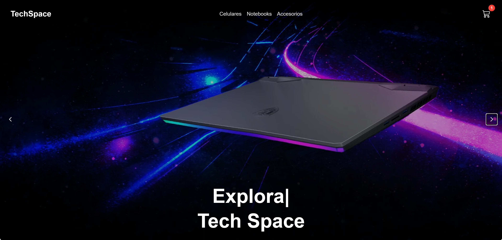
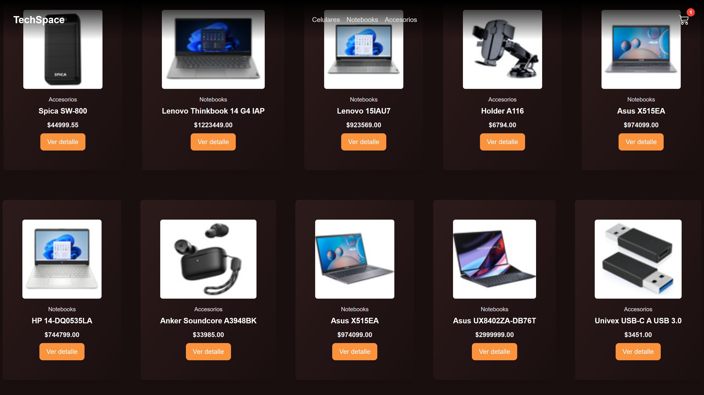
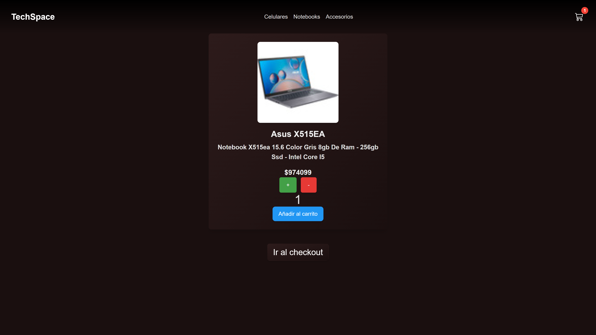
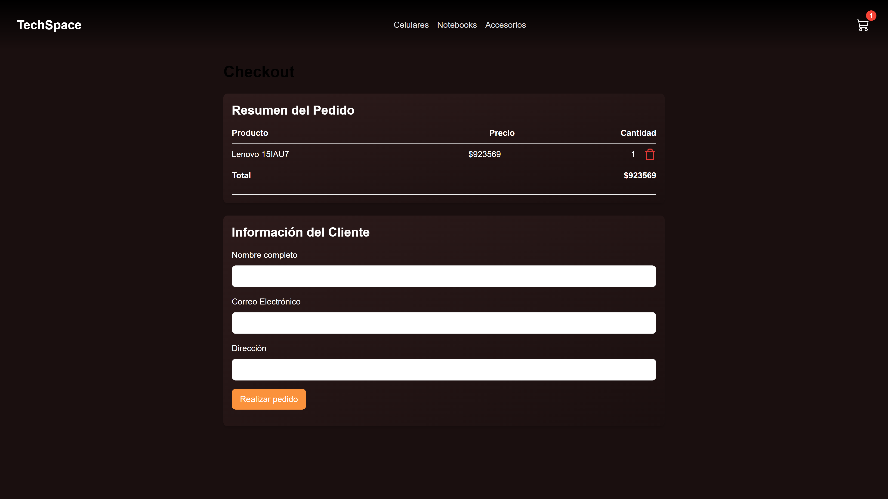

# 🚀 Tech Space

**Tech Space** es una aplicación desarrollada como proyecto frontend en React. Utiliza Firebase y Firestore para administrar productos, órdenes de clientes y procesos de checkout, con un enfoque responsive.

## 👨‍💻 Autor

Desarrollado por **Sebastián Blanar**

## 🌐 Demo

👉 [tech-space.vercel.app](https://tech-space-e-commerce-mruw5o50z.vercel.app/)

## 📸 Capturas






## 🛠️ Tecnologías utilizadas

- ⚛️ React (con Vite)
- 🎨 Tailwind CSS
- 🔥 Firebase & Firestore
- 🧠 JavaScript (ES6+)

## 📦 Instalación local

```bash
git clone https://github.com/SebastianBlanar/Tech-Space-e-commerce.git
cd tech-space
npm install
npm run dev
